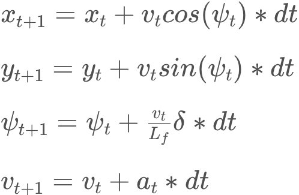
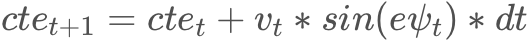
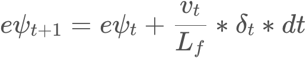

# CarND-Controls-MPC
Self-Driving Car Engineer Nanodegree Program

---

## Setup & Run

Instructions can be found in the original repository [https://github.com/udacity/CarND-MPC-Project](https://github.com/udacity/CarND-MPC-Project/tree/98a9b723cd70d955e8e7948cda2f5b289165106e)

# Writeup

The below paragraphs contain information about the project and how the solution was implemented.

### Model

The kinematic model has been used for the purpose of this project.

The state of the model is composed of the following state vector [**x**, **y**, **psi**, **v**]:
- **x** position in x
- **y** position in y
- **psi** yaw angle
- **v** speed

and by the following actuator vector [**delta**, **a**]:
- **delta** steering angle (range -25°, 25°)
- **a** acceleration (range 1, 0) or braking (range 0 -1) 

The state update equations are described by the below equations



To compute the errors the following equations were used




### Parameters

The final number of timesteps chosen for the project was **N=15**. Choosing *N=10* caused the car to not be able to 
react in time to changes in the road. Choosing *N=25* resulted in **overfitting** of the 3rd degree polynomial, 
thus unexpected bends were produced and the car would get off the desired trajectory.

The timestep evaluation frequency choes was **dt=0.05**, it easily permits the accommodation of 100ms input lag. 

The following code snippet show the used cost weight 

```cpp
// cost weights
static std::vector<double> COST_WEIGHT_REFERENCE_STATE = {1, 10, 1};
static std::vector<double> COST_WEIGHT_ACTUATORS = {10, 1};
static std::vector<double> COST_WEIGHT_SEQUENTIAL_ACTUATORS = {600, 1};
```

The reference velocity chosen was **ref_v=65**, being the highest reachable velocity, which kept the car on the track 
as requested by the project.

### Waypoints

A third degree polynomial was used for the fitting; as suggested in the lessons it gave one of the best results. The 
polynomial was fitted in card coordinates, afterwards the waypoints are transformed from map to car coordinates.

### Latency

Because **dt=50ms**, to simulate the 100ms input delay the third actuator activation from the solution was taken.